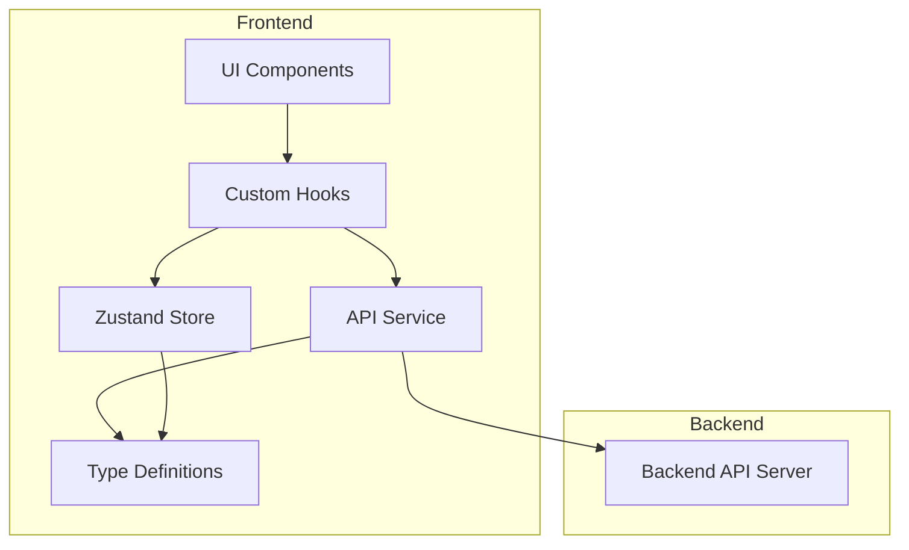
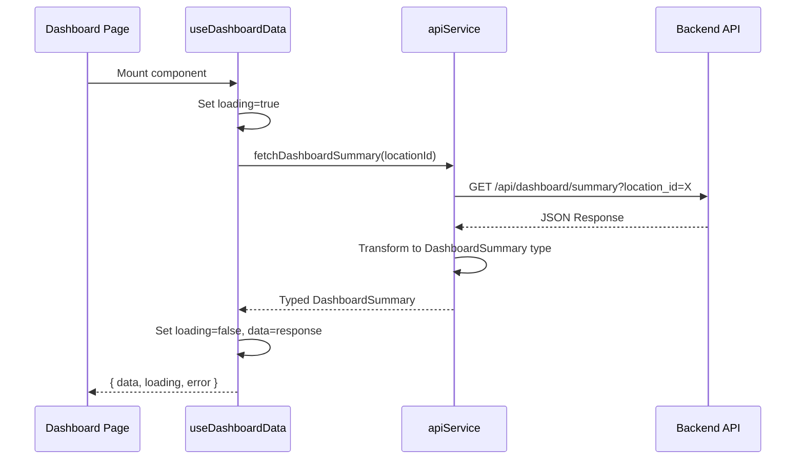

# Design Document: API Integration

## Overview

This design describes the integration of the Review Intelligence frontend with the backend API. The integration follows a layered architecture pattern where a centralized API service handles all HTTP communication, transforming backend responses into frontend-compatible types. The existing UI components remain unchanged; only their data sources are modified.

The key architectural decisions are:
1. **Single API Service Module** - All API calls go through one service file for consistency
2. **Type Transformation Layer** - API responses are mapped to existing frontend types where possible
3. **React Hooks for Data Fetching** - Custom hooks encapsulate loading/error states
4. **Zustand Store Extension** - Store is extended to hold fetched data and loading states

## Architecture



### Data Flow

1. **Page Load**: Component mounts → Custom hook triggers → API service called → Response transformed → Store updated → UI re-renders
2. **User Action (filter/location change)**: Event handler → Hook refetch → API call with params → Store update → UI update
3. **Chat Message**: User input → API POST → Response displayed → Message added to store

### Request/Response Flow



## Components and Interfaces

### API Service (`services/apiService.ts`)

The API service provides typed functions for each backend endpoint.

```typescript
// Configuration
const BASE_URL = import.meta.env.VITE_API_BASE_URL || 'http://localhost:8000';
const DEFAULT_TIMEOUT = 30000;

// Core fetch wrapper with error handling
async function apiFetch<T>(
  endpoint: string, 
  options?: RequestInit
): Promise<T>

// Dashboard APIs
function fetchDashboardSummary(locationId: string): Promise<DashboardSummary>
function fetchDashboardTrends(locationId: string, period: 'day' | 'week' | 'month'): Promise<TrendsResponse>
function fetchDashboardTopics(locationId: string): Promise<TopicsResponse>
function fetchDashboardSentiment(locationId: string): Promise<SentimentResponse>
function fetchRecentReviews(locationId: string): Promise<ReviewsResponse>
function fetchReviewsByTopic(topic: string, locationId: string, limit?: number): Promise<ReviewsResponse>

// Core APIs
function fetchLocations(): Promise<LocationsResponse>
function fetchStats(locationId: string): Promise<StatsResponse>
function fetchInsights(locationId: string, regenerate?: boolean): Promise<InsightsResponse>
function fetchReviews(params: ReviewsParams): Promise<ReviewsResponse>

// Chat API
function sendChatMessage(query: string, locationId: string, useSemantic?: boolean): Promise<ChatResponse>
```

### Custom Hooks (`hooks/`)

Custom hooks encapsulate data fetching logic with loading and error states.

```typescript
// hooks/useDashboardData.ts
function useDashboardData(locationId: string): {
  summary: DashboardSummary | null;
  trends: TrendsResponse | null;
  topics: TopicsResponse | null;
  sentiment: SentimentResponse | null;
  isLoading: boolean;
  error: Error | null;
  refetch: () => void;
}

// hooks/useReviews.ts
function useReviews(params: ReviewsParams): {
  reviews: Review[];
  isLoading: boolean;
  error: Error | null;
  refetch: () => void;
}

// hooks/useLocations.ts
function useLocations(): {
  locations: string[];
  isLoading: boolean;
  error: Error | null;
}

// hooks/useChat.ts
function useChat(): {
  sendMessage: (query: string) => Promise<void>;
  isLoading: boolean;
  error: Error | null;
}
```

### Store Extensions (`store.ts`)

The Zustand store is extended to hold API data and loading states.

```typescript
interface AppState {
  // Existing
  currentLocation: string;
  setLocation: (loc: string) => void;
  messages: ChatMessage[];
  // ... existing chat state
  
  // New: Locations
  locations: string[];
  locationsLoading: boolean;
  setLocations: (locations: string[]) => void;
  setLocationsLoading: (loading: boolean) => void;
  
  // New: Dashboard data
  dashboardSummary: DashboardSummary | null;
  dashboardTrends: TrendsResponse | null;
  dashboardTopics: TopicsResponse | null;
  dashboardSentiment: SentimentResponse | null;
  dashboardLoading: boolean;
  dashboardError: Error | null;
  setDashboardData: (data: Partial<DashboardData>) => void;
  
  // New: Reviews data
  reviews: Review[];
  reviewsLoading: boolean;
  reviewsError: Error | null;
  setReviews: (reviews: Review[]) => void;
  setReviewsLoading: (loading: boolean) => void;
}
```

## Data Models

### API Response Types (`types/api.ts`)

These types match the backend API response structures exactly.

```typescript
// Dashboard Summary Response
interface DashboardSummary {
  total_reviews: number;
  average_rating: number;
  sentiment_breakdown: {
    negative: number;
    neutral: number;
    positive: number;
  };
  rating_distribution: Record<string, number>;
  top_topics: Array<{
    topic: string;
    count: number;
  }>;
  generated_at: string;
}

// Trends Response
interface TrendsResponse {
  rating_trends: Array<{
    period: string;
    avg_rating: number;
    count: number;
  }>;
  sentiment_trends: Array<{
    period: string;
    negative: number;
    neutral: number;
    positive: number;
  }>;
}

// Topics Response
interface TopicsResponse {
  topics: Array<{
    topic: string;
    count: number;
    avg_rating: number;
    sentiment_split: {
      positive: number;
      negative: number;
      neutral: number;
    };
  }>;
}

// Reviews Response
interface ReviewsResponse {
  reviews: Array<{
    id: number;
    location_id: string;
    source: string;
    rating: number;
    review_text: string;
    reviewer_name: string;
    review_date: string;
    sentiment: 'positive' | 'negative' | 'neutral';
    sentiment_score: number;
    topics: string[];
    entities: string[];
  }>;
}

// Locations Response
interface LocationsResponse {
  locations: string[];
}

// Chat Response
interface ChatResponse {
  response: string;
  sources?: Array<{
    review_id: number;
    text: string;
    relevance_score: number;
  }>;
}

// Request Parameters
interface ReviewsParams {
  location_id: string;
  min_rating?: number;
  max_rating?: number;
  sentiment?: 'positive' | 'negative' | 'neutral';
  limit?: number;
}

interface ChatRequest {
  query: string;
  location_id: string;
  use_semantic: boolean;
}
```

### Type Transformations

The API service transforms backend responses to frontend-compatible types.

```typescript
// Transform API Review to Frontend Review
function transformReview(apiReview: ApiReview): Review {
  return {
    id: String(apiReview.id),
    author: apiReview.reviewer_name,
    rating: apiReview.rating,
    date: formatDate(apiReview.review_date),
    content: apiReview.review_text,
    sentiment: apiReview.sentiment,
    topics: apiReview.topics
  };
}

// Transform API Topics to Frontend TopicData
function transformTopic(apiTopic: ApiTopic): TopicData {
  const total = apiTopic.sentiment_split.positive + 
                apiTopic.sentiment_split.negative + 
                apiTopic.sentiment_split.neutral;
  const dominantSentiment = getDominantSentiment(apiTopic.sentiment_split);
  
  return {
    topic: apiTopic.topic,
    count: apiTopic.count,
    percentage: calculatePercentage(apiTopic.count, totalReviews),
    sentiment: dominantSentiment
  };
}
```


## Correctness Properties

*A property is a characteristic or behavior that should hold true across all valid executions of a system—essentially, a formal statement about what the system should do. Properties serve as the bridge between human-readable specifications and machine-verifiable correctness guarantees.*

Based on the prework analysis, the following properties can be verified through property-based testing:

### Property 1: Error Response Structure

*For any* HTTP error response (4xx or 5xx status codes), the API service SHALL throw an error object containing both the status code and a descriptive message.

**Validates: Requirements 1.3**

### Property 2: Response Transformation Consistency

*For any* valid API response from the backend, the transformation function SHALL produce an output that conforms to the expected frontend TypeScript interface structure, with all required fields present and correctly typed.

**Validates: Requirements 1.5**

### Property 3: Location Change Data Refresh

*For any* location change event, the system SHALL trigger refetch of all dashboard data (summary, trends, topics, sentiment) with the new location_id parameter.

**Validates: Requirements 3.7, 6.3**

### Property 4: Filter Parameter Propagation

*For any* combination of review filters (rating range, sentiment, topic), the API request SHALL include the corresponding query parameters with the exact values specified by the user.

**Validates: Requirements 4.2, 4.3, 4.4**

### Property 5: Chat Request Completeness

*For any* chat message sent by the user, the POST request to /api/chat SHALL include a body with query (the user's message), location_id (current location), and use_semantic (boolean) fields.

**Validates: Requirements 5.1**

### Property 6: Stale Data Prevention

*For any* failed data refresh attempt, the system SHALL either clear the previous data or mark it as stale, ensuring users are not presented with outdated information as if it were current.

**Validates: Requirements 7.4**

## Error Handling

### API Error Handling Strategy

```typescript
class ApiError extends Error {
  constructor(
    public statusCode: number,
    public message: string,
    public endpoint: string
  ) {
    super(message);
    this.name = 'ApiError';
  }
}

async function apiFetch<T>(endpoint: string, options?: RequestInit): Promise<T> {
  const controller = new AbortController();
  const timeoutId = setTimeout(() => controller.abort(), DEFAULT_TIMEOUT);
  
  try {
    const response = await fetch(`${BASE_URL}${endpoint}`, {
      ...options,
      signal: controller.signal,
      headers: {
        'Content-Type': 'application/json',
        ...options?.headers,
      },
    });
    
    clearTimeout(timeoutId);
    
    if (!response.ok) {
      const errorBody = await response.json().catch(() => ({}));
      throw new ApiError(
        response.status,
        errorBody.detail || errorBody.message || `Request failed with status ${response.status}`,
        endpoint
      );
    }
    
    return response.json();
  } catch (error) {
    clearTimeout(timeoutId);
    
    if (error instanceof ApiError) {
      throw error;
    }
    
    if (error.name === 'AbortError') {
      throw new ApiError(408, 'Request timeout', endpoint);
    }
    
    throw new ApiError(0, 'Network error', endpoint);
  }
}
```

### Component Error Handling

Each page component handles errors through the custom hooks:

```typescript
function DashboardPage() {
  const { data, isLoading, error, refetch } = useDashboardData(currentLocation);
  
  if (error) {
    return (
      <ErrorState 
        message={error.message}
        onRetry={refetch}
      />
    );
  }
  
  if (isLoading) {
    return <LoadingState />;
  }
  
  return <DashboardContent data={data} />;
}
```

### Error State Component

```typescript
interface ErrorStateProps {
  message: string;
  onRetry?: () => void;
}

function ErrorState({ message, onRetry }: ErrorStateProps) {
  return (
    <Card className="p-8 text-center">
      <AlertTriangle className="mx-auto text-status-warning mb-4" size={48} />
      <h3 className="text-lg font-bold text-text-primary mb-2">
        Unable to load data
      </h3>
      <p className="text-text-secondary mb-4">{message}</p>
      {onRetry && (
        <Button onClick={onRetry} variant="primary">
          Try Again
        </Button>
      )}
    </Card>
  );
}
```

## Testing Strategy

### Unit Tests

Unit tests verify specific examples and edge cases:

1. **API Service Tests**
   - Test each endpoint function makes correct HTTP request
   - Test error handling for various HTTP status codes
   - Test timeout handling
   - Test base URL configuration

2. **Transformation Tests**
   - Test transformReview with sample API response
   - Test transformTopic with sample data
   - Test edge cases (missing fields, null values)

3. **Hook Tests**
   - Test loading state transitions
   - Test error state handling
   - Test refetch functionality

4. **Component Tests**
   - Test loading indicator display
   - Test error message display
   - Test data rendering after successful fetch

### Property-Based Tests

Property-based tests verify universal properties across generated inputs. Use a library like `fast-check` for TypeScript.

**Configuration**: Minimum 100 iterations per property test.

1. **Property 1 Test: Error Response Structure**
   - Generate random HTTP error status codes (400-599)
   - Generate random error messages
   - Verify thrown error contains status and message
   - **Feature: api-integration, Property 1: Error Response Structure**

2. **Property 2 Test: Response Transformation**
   - Generate random valid API response objects
   - Apply transformation function
   - Verify output has all required frontend interface fields
   - **Feature: api-integration, Property 2: Response Transformation Consistency**

3. **Property 3 Test: Location Change Refresh**
   - Generate random location strings
   - Simulate location change
   - Verify all data fetch functions called with new location
   - **Feature: api-integration, Property 3: Location Change Data Refresh**

4. **Property 4 Test: Filter Parameter Propagation**
   - Generate random filter combinations (ratings 1-5, sentiments, topics)
   - Apply filters
   - Verify API request includes exact filter values
   - **Feature: api-integration, Property 4: Filter Parameter Propagation**

5. **Property 5 Test: Chat Request Completeness**
   - Generate random chat messages and locations
   - Send chat message
   - Verify POST body contains query, location_id, use_semantic
   - **Feature: api-integration, Property 5: Chat Request Completeness**

6. **Property 6 Test: Stale Data Prevention**
   - Generate random initial data state
   - Simulate failed refresh
   - Verify data is cleared or marked stale
   - **Feature: api-integration, Property 6: Stale Data Prevention**

### Integration Tests

Integration tests verify end-to-end flows with mocked API:

1. Dashboard loads and displays real data structure
2. Reviews page filters work correctly
3. Chat sends messages and displays responses
4. Location change updates all views

### Test File Structure

```
src/
├── services/
│   └── __tests__/
│       ├── apiService.test.ts
│       └── apiService.property.test.ts
├── hooks/
│   └── __tests__/
│       ├── useDashboardData.test.ts
│       └── useReviews.test.ts
├── pages/
│   └── __tests__/
│       ├── DashboardPage.test.tsx
│       └── ReviewsPage.test.tsx
└── types/
    └── __tests__/
        └── transformations.property.test.ts
```
