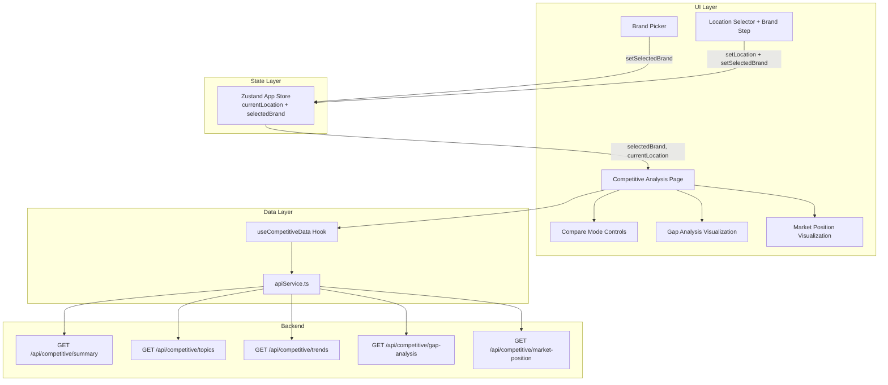

# Design Document: Competitive Analysis Enhancement

## Overview

This design extends the Review Intelligence Dashboard's competitive analysis capabilities by integrating two new API endpoints (gap-analysis, market-position), adding brand filtering via a Brand Picker component and a brand selection step in the Location Selector modal, enhancing the Zustand store with brand state, and enriching the Competitive Analysis page with gap analysis visualization, market position view, and a compare mode.

The existing codebase already has a `CompetitiveAnalysisPage.tsx` with brand scorecards, rating comparison bar chart, rating trends line chart, and topic comparison table. The `useCompetitiveData` hook fetches from three endpoints (summary/analysis, trends, topics). This design adds the remaining two endpoints and the new UI components.

Technology stack: React 18, TypeScript, Zustand (state), Recharts (charts), Tailwind CSS, Lucide icons.

## Architecture



### Data Flow

1. User selects location via Location Selector (step 1) → optionally selects brand (step 2) → store updates `currentLocation` and `selectedBrand`
2. User can also change brand via Brand Picker dropdown → store updates `selectedBrand`
3. `useCompetitiveData` hook reacts to `currentLocation`, `selectedBrand`, and `period` changes → fetches all 5 endpoints in parallel
4. Competitive Analysis Page renders visualizations from hook data, filtered by compare mode selections if active

## Components and Interfaces

### 1. Brand Picker Component

**File**: `components/BrandPicker/BrandPicker.tsx`

A dropdown component placed in the app header/sidebar. It reads `currentLocation` and `selectedBrand` from the store, derives the brand list from the competitive summary data, and calls `setSelectedBrand` on selection.

```typescript
interface BrandPickerProps {
  brands: BrandMetrics[];       // from competitive summary
  selectedBrand: string | null; // from store
  onSelectBrand: (brand: string | null) => void;
}
```

Behavior:
- Groups brands into "Our Brands" and "Competitors" sections
- Shows "All Brands" as the default/reset option
- Displays a colored indicator (purple for own, red for competitor) next to each brand name
- Closes dropdown on selection or outside click

### 2. Location Selector Brand Step

**File**: `components/LocationSelector/LocationSelector.tsx` (modify existing)

Add a `step` state (`'location' | 'brand'`) to the existing modal. After a location is selected, transition to step 2 which shows available brands at that location.

State additions:
```typescript
const [step, setStep] = useState<'location' | 'brand'>('location');
const [pendingLocationId, setPendingLocationId] = useState<string | null>(null);
```

Step 2 UI:
- Header shows "Select Brand at {location name}" with a back button
- Brand list grouped into Own Brands / Competitors
- "Skip / All Brands" button at the top that confirms location with no brand filter
- Selecting a brand calls `onSelectLocation(locationId)` and a new `onSelectBrand(brand)` callback, then closes

### 3. Gap Analysis Visualization

**File**: `components/competitive/GapAnalysisChart.tsx` (new)

A horizontal bar chart showing topic-level gaps. Topics with negative gap scores (our strengths) render bars extending left in purple. Topics with positive gap scores (our weaknesses) render bars extending right in red.

```typescript
interface GapAnalysisChartProps {
  topics: GapAnalysisResponse['topics'];
}
```

Uses Recharts `BarChart` with horizontal layout. Bars are colored by sign of `gap_score`. Sorted so largest absolute gaps appear at top.

### 4. Market Position Visualization

**File**: `components/competitive/MarketPositionChart.tsx` (new)

A combined view with:
- A horizontal bar chart showing review share percentage per brand
- Rating rank badges next to each brand name
- Own brands in purple, competitors in red

```typescript
interface MarketPositionChartProps {
  brands: MarketPositionResponse['brands'];
}
```

### 5. Compare Mode Controls

**File**: Inline in `CompetitiveAnalysisPage.tsx`

A toggle button activates compare mode. When active, brand checkboxes appear. Selected brands filter all visualizations on the page.

State:
```typescript
const [compareMode, setCompareMode] = useState(false);
const [comparedBrands, setComparedBrands] = useState<string[]>([]);
```

Filtering logic: when `compareMode` is true and `comparedBrands.length >= 2`, all data arrays are filtered to include only brands in `comparedBrands`.

### 6. Updated useCompetitiveData Hook

**File**: `hooks/useCompetitiveData.ts` (modify existing)

Add `gapAnalysis` and `marketPosition` to the returned data. Add optional `brand` parameter. Fetch all 5 endpoints in parallel with `Promise.allSettled` so partial failures don't block other data.

```typescript
interface UseCompetitiveDataResult {
  analysis: CompetitiveAnalysisResponse | null;
  trends: CompetitiveTrendsResponse | null;
  topics: CompetitiveTopicsResponse | null;
  gapAnalysis: GapAnalysisResponse | null;
  marketPosition: MarketPositionResponse | null;
  isLoading: boolean;
  error: Error | null;
  refetch: () => void;
}

export function useCompetitiveData(
  locationId: string,
  period: CompetitivePeriod = 'week',
  brand?: string | null
): UseCompetitiveDataResult
```

### 7. Updated App Store

**File**: `store.ts` (modify existing)

Add `selectedBrand` state and `setSelectedBrand` action. Modify `setLocation` to reset `selectedBrand` to null.

```typescript
// New state
selectedBrand: string | null;
setSelectedBrand: (brand: string | null) => void;

// Modified setLocation
setLocation: (loc: string) => void; // also resets selectedBrand to null
```

## Data Models

### GapAnalysisResponse

```typescript
export interface GapAnalysisResponse {
  location_id: string;
  topics: Array<{
    topic: string;
    own_avg_rating: number;
    competitor_avg_rating: number;
    gap_score: number; // positive = competitors better, negative = we're better
  }>;
  generated_at: string;
}
```

### MarketPositionResponse

```typescript
export interface MarketPositionResponse {
  location_id: string;
  brands: Array<{
    brand: string;
    is_own_brand: boolean;
    review_share_pct: number;
    avg_rating: number;
    rating_rank: number;
  }>;
  generated_at: string;
}
```

### Store State Extension

```typescript
// Added to AppState interface
selectedBrand: string | null;
setSelectedBrand: (brand: string | null) => void;
```

### Brand Filtering

When `selectedBrand` is set, the hook passes `?brand={selectedBrand}` to endpoints that support it. The page-level filtering for compare mode operates client-side on the already-fetched data arrays.

## Correctness Properties

*A property is a characteristic or behavior that should hold true across all valid executions of a system — essentially, a formal statement about what the system should do. Properties serve as the bridge between human-readable specifications and machine-verifiable correctness guarantees.*

### Property 1: Brand partitioning preserves all brands and correctly classifies them

*For any* array of BrandMetrics, partitioning into own brands and competitor brands should produce two arrays whose combined length equals the original array length, where every brand with `is_own_brand === true` appears in the own array and every brand with `is_own_brand === false` appears in the competitor array.

**Validates: Requirements 1.2, 2.2**

### Property 2: Store brand selection updates state correctly

*For any* brand string (or null), calling `setSelectedBrand` on the store should result in `selectedBrand` equaling the provided value.

**Validates: Requirements 1.3, 6.2**

### Property 3: Location change resets selected brand

*For any* location string and any prior selectedBrand value, calling `setLocation` should result in `selectedBrand` being null.

**Validates: Requirements 1.5, 6.3**

### Property 4: API functions construct correct URLs with location_id

*For any* non-empty location_id string, the gap analysis and market position API fetch functions should construct URLs containing the properly encoded location_id as a query parameter.

**Validates: Requirements 3.1, 4.1**

### Property 5: Gap analysis topics are correctly partitioned and sorted

*For any* array of gap analysis topics, partitioning into strengths (gap_score < 0) and weaknesses (gap_score > 0) should produce arrays where: all strength items have negative gap scores sorted ascending, all weakness items have positive gap scores sorted descending, and no topic is lost or duplicated.

**Validates: Requirements 3.3, 3.4**

### Property 6: Partial API failure resilience

*For any* combination of 5 endpoint results where at least one succeeds and at least one fails, the hook should return non-null data for the successful endpoints and null for the failed endpoints, with the error state set.

**Validates: Requirements 5.2**

### Property 7: Brand parameter is forwarded to API calls

*For any* non-null brand string, the competitive data hook should include the brand as a query parameter in all API calls that support brand filtering.

**Validates: Requirements 5.3**

### Property 8: Compare mode filtering returns exactly selected brands

*For any* array of brand data and any subset of brand names with size >= 2, filtering the data by the selected brands should return exactly the brands in the subset, preserving their data unchanged.

**Validates: Requirements 7.3**

### Property 9: Compare mode deactivation round-trip

*For any* array of brand data, activating compare mode, selecting a subset of brands, then deactivating compare mode should restore the full original unfiltered dataset.

**Validates: Requirements 7.5**

### Property 10: Market position data completeness

*For any* MarketPositionResponse brands array, each rendered brand entry should include the brand name, review share percentage, average rating, and rating rank.

**Validates: Requirements 4.3**

## Error Handling

| Scenario | Behavior |
|---|---|
| Single endpoint failure in hook | `Promise.allSettled` catches the failure; the corresponding state field is set to null, other fields populated normally, `error` state set with the failure details |
| All endpoints fail | All data fields null, `error` set, page shows full error state with retry button |
| Network timeout | `apiFetch` existing 30s timeout throws `ApiError(408)`, caught by hook |
| Empty brand list at location | Brand Picker shows only "All Brands" option; Location Selector step 2 shows "No brands available" message with skip option |
| Invalid brand parameter | API returns 400; hook sets error, page falls back to unfiltered view |

## Testing Strategy

### Property-Based Testing

Library: **fast-check** (TypeScript property-based testing library)

Each property test runs a minimum of 100 iterations with randomly generated inputs. Tests are tagged with the format: `Feature: competitive-analysis, Property N: {property_text}`.

Properties 1, 2, 3, 5, 8, and 9 are pure function tests that can run without mocking. Properties 4, 6, 7, and 10 require mocking the API layer or inspecting function arguments.

### Unit Testing

Unit tests complement property tests by covering:
- Specific examples: known brand lists, known gap analysis data
- Edge cases: empty arrays, single brand, all own brands, all competitors
- Error conditions: API failures, malformed responses
- UI state transitions: compare mode toggle, location selector step navigation

### Test Organization

- `__tests__/utils/brandPartition.test.ts` — Property 1 + unit tests for partitionBrands
- `__tests__/store.test.ts` — Properties 2, 3 + unit tests for store actions
- `__tests__/services/apiService.test.ts` — Properties 4, 7 + unit tests for new API functions
- `__tests__/hooks/useCompetitiveData.test.ts` — Property 6 + unit tests for hook behavior
- `__tests__/utils/gapAnalysis.test.ts` — Property 5 + unit tests for gap partitioning/sorting
- `__tests__/utils/compareMode.test.ts` — Properties 8, 9 + unit tests for compare filtering
- `__tests__/components/MarketPositionChart.test.ts` — Property 10 + unit tests for rendering
