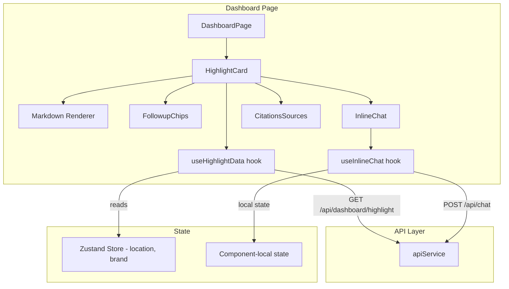

# Design Document: Dashboard AI Highlight

## Overview

This feature replaces the existing simple alert banner on the Dashboard page with a rich, AI-powered highlight analysis card. The card renders full markdown analysis inline, supports interactive followup questions with inline responses, and displays collapsible citation sources. The architecture introduces a dedicated highlight hook with local state for inline chat, updated API types matching the new backend contract, and new UI components that integrate with the existing brutalist design system.

The key architectural decision is to keep the inline chat state local to the highlight component (via a custom hook) rather than using the global Zustand store. This prevents conflicts with the existing AI Analysis page's chat state and keeps the component self-contained.

## Architecture



### Key Design Decisions

1. **Dedicated `useHighlightData` hook**: Separates highlight fetching from the main `useDashboardData` hook. The highlight has unique refresh semantics (manual `refresh=true`) and longer loading times (5-15s for generation) that warrant independent state management. The existing `useDashboardData` hook continues to fetch the highlight for backward compatibility during the transition, but the new `HighlightCard` uses its own hook.

2. **Local inline chat state**: The followup chat uses a `useInlineChat` hook with `useState`/`useRef` rather than the global Zustand chat store. This avoids polluting the AI Analysis page's conversation history and keeps the inline chat scoped to the dashboard session.

3. **Component composition**: The `HighlightCard` is composed of smaller sub-components (`FollowupChips`, `InlineChat`, `CitationsSources`) for testability and reuse. Each sub-component receives props and has no direct store dependencies.

## Components and Interfaces

### HighlightCard Component

The primary container component that orchestrates the highlight display.

```typescript
interface HighlightCardProps {
  locationId: string;
  brand?: string;
}
```

Renders:
- Header: location badge + brand pill + severity indicator icon
- Body: markdown-rendered `analysis` content
- Followup chips section
- Inline chat responses section
- Collapsible citations section
- Footer: relative timestamp + cached indicator + refresh button + navigation link

### FollowupChips Component

Renders the suggested followup questions as clickable buttons.

```typescript
interface FollowupChipsProps {
  questions: string[];
  onQuestionClick: (question: string) => void;
  disabled?: boolean;
}
```

### InlineChat Component

Displays followup responses and a custom question input.

```typescript
interface InlineChatMessage {
  question: string;
  answer: string | null;
  isLoading: boolean;
  error: string | null;
}

interface InlineChatProps {
  messages: InlineChatMessage[];
  onSubmitQuestion: (question: string) => void;
  isLoading: boolean;
}
```

### CitationsSources Component

Collapsible section showing source review citations.

```typescript
interface HighlightCitation {
  text: string;
  location: Record<string, unknown>;
  metadata: Record<string, unknown>;
}

interface CitationsSourcesProps {
  citations: HighlightCitation[];
}
```

### useHighlightData Hook

Manages highlight data fetching with refresh capability.

```typescript
interface UseHighlightDataResult {
  data: HighlightData | null;
  isLoading: boolean;
  isRefreshing: boolean;
  error: Error | null;
  refresh: () => void;
  refetch: () => void;
}

function useHighlightData(locationId: string, brand?: string): UseHighlightDataResult;
```

- `refetch()`: Calls API with `refresh=false` (uses cache)
- `refresh()`: Calls API with `refresh=true` (bypasses cache)
- Tracks `isRefreshing` separately from `isLoading` so the card can show existing content with a spinner overlay during refresh

### useInlineChat Hook

Manages local chat state for followup questions.

```typescript
interface UseInlineChatResult {
  messages: InlineChatMessage[];
  sendQuestion: (question: string) => void;
  isLoading: boolean;
}

function useInlineChat(): UseInlineChatResult;
```

- Appends each question/answer pair to a local messages array
- Calls `sendChatMessage` from `apiService` for each question
- Handles per-message loading and error states

## Data Models

### Updated HighlightResponse Type

Replaces the existing `HighlightResponse` in `types/api.ts`:

```typescript
export interface HighlightCitation {
  text: string;
  location: Record<string, unknown>;
  metadata: Record<string, unknown>;
}

export interface HighlightData {
  location_id: string;
  brand: string;
  analysis: string;
  severity: 'critical' | 'warning' | 'info';
  followup_questions: string[];
  citations: HighlightCitation[];
}

export interface HighlightResponse {
  highlight: HighlightData | null;
  cached: boolean;
  generated_at: string;
}
```

### Severity Configuration Map

Used by the HighlightCard to derive styling from severity:

```typescript
const SEVERITY_CONFIG = {
  critical: {
    borderColor: 'border-sentiment-negative',
    accentBg: 'bg-sentiment-negative/10',
    accentText: 'text-sentiment-negative',
    icon: AlertTriangle,
    label: 'Critical',
    pulse: true,
  },
  warning: {
    borderColor: 'border-status-warning',
    accentBg: 'bg-status-warning/10',
    accentText: 'text-status-warning',
    icon: AlertCircle,
    label: 'Warning',
    pulse: false,
  },
  info: {
    borderColor: 'border-status-info',
    accentBg: 'bg-status-info/10',
    accentText: 'text-status-info',
    icon: Info,
    label: 'Info',
    pulse: false,
  },
} as const;
```

### InlineChatMessage Model

```typescript
interface InlineChatMessage {
  id: string;
  question: string;
  answer: string | null;
  isLoading: boolean;
  error: string | null;
}
```


## Correctness Properties

*A property is a characteristic or behavior that should hold true across all valid executions of a system — essentially, a formal statement about what the system should do. Properties serve as the bridge between human-readable specifications and machine-verifiable correctness guarantees.*

### Property 1: Highlight fetch uses correct parameters

*For any* valid location ID and optional brand string, calling `useHighlightData` (or triggering a refetch via location/brand change) SHALL produce an API request to `/api/dashboard/highlight` with query parameters `location_id` equal to the provided location, `brand` equal to the provided brand (when present), and `refresh=false` for non-refresh fetches.

**Validates: Requirements 1.1, 1.4**

### Property 2: Markdown content renders to HTML

*For any* valid markdown string containing bold markers (`**text**`), paragraph breaks, or heading markers (`#`, `##`), rendering it through the markdown renderer SHALL produce output containing the corresponding HTML semantic elements (`<strong>`, `<p>`, `<h1>`/`<h2>`).

**Validates: Requirements 1.2, 4.3**

### Property 3: Severity maps to correct styling configuration

*For any* severity value in `{'critical', 'warning', 'info'}`, the rendered Highlight_Card SHALL contain CSS classes matching the corresponding entry in the `SEVERITY_CONFIG` map (border color, accent background, accent text color) and render the corresponding icon component.

**Validates: Requirements 2.4**

### Property 4: Relative timestamp formatting

*For any* valid ISO 8601 timestamp string, the relative time formatter SHALL produce a non-empty human-readable string (e.g., "2 hours ago", "3 days ago") that correctly reflects the time difference from the current moment.

**Validates: Requirements 3.3**

### Property 5: Refresh calls API with refresh=true

*For any* state where highlight data is loaded, invoking the `refresh` function from `useHighlightData` SHALL produce an API request with the query parameter `refresh=true`, and the `isRefreshing` flag SHALL be `true` until the response arrives.

**Validates: Requirements 3.4**

### Property 6: Followup questions render as chips

*For any* non-empty array of followup question strings (length 1 to N), the FollowupChips component SHALL render exactly N clickable button elements, each containing the corresponding question text.

**Validates: Requirements 4.1**

### Property 7: Question submission calls Chat API with exact text

*For any* non-empty question string (whether from a followup chip click or custom text input), submitting it through the inline chat SHALL trigger a `POST /api/chat` request with a body containing `{ query: <question_string> }` where the query matches the input exactly.

**Validates: Requirements 4.2, 4.5**

### Property 8: Chat error produces error state with retry

*For any* Chat_API request that fails (network error, timeout, or HTTP error), the corresponding `InlineChatMessage` SHALL have a non-null `error` string and a `null` answer, and retrying that message SHALL re-send the same question to the Chat_API.

**Validates: Requirements 4.6**

### Property 9: Citation count matches array length

*For any* non-empty citations array of length N, the collapsed Sources section SHALL display text containing the number N (e.g., "N Sources").

**Validates: Requirements 5.1, 5.2**

### Property 10: Citation text truncation

*For any* citation with a `text` field longer than 100 characters, the initially displayed text in the expanded Sources section SHALL be at most approximately 100 characters, and an expand control SHALL be present.

**Validates: Requirements 5.3**

### Property 11: fetchDashboardHighlight URL construction

*For any* combination of `locationId` (string), `brand` (string or undefined), and `refresh` (boolean or undefined), the `fetchDashboardHighlight` function SHALL construct a URL where: `location_id` query param equals `locationId`, `brand` query param is present only when brand is defined, and `refresh` query param is `"true"` only when refresh is `true`.

**Validates: Requirements 8.4**

### Property 12: Header displays location, brand, and severity

*For any* valid `HighlightData` object with a `location_id`, `brand`, and `severity`, the Highlight_Card header SHALL contain the location code text, the brand name text (when brand filter is active), and the severity icon/label.

**Validates: Requirements 1.5**

## Error Handling

### API Error Scenarios

| Error | Source | Handling |
|-------|--------|----------|
| HTTP 502 | Highlight_API | Display "Failed to generate highlight from Knowledge Base" with retry button |
| HTTP 4xx/5xx (non-502) | Highlight_API | Display generic "Failed to load highlight" with retry button |
| Network error / timeout | Highlight_API | Display "Network error" with retry button |
| HTTP 4xx/5xx | Chat_API (followup) | Show per-message error with retry button; other messages unaffected |
| Network error / timeout | Chat_API (followup) | Show per-message "Network error" with retry button |

### Error State Hierarchy

1. **No location selected**: Show placeholder — not an error state
2. **API loading**: Show skeleton — not an error state
3. **API error (highlight)**: Show `ErrorState` component with retry, replacing entire card content
4. **API error (chat followup)**: Show inline error on the specific message only; highlight card and other messages remain visible
5. **Null highlight**: Show "No highlight available" message — not an error state

### Retry Behavior

- Highlight retry: Calls `refetch()` which uses `refresh=false`
- Refresh retry: Calls `refresh()` which uses `refresh=true`
- Chat retry: Re-sends the exact same question string to the Chat_API
- All retry buttons are disabled while the corresponding request is in progress

## Testing Strategy

### Property-Based Testing

Use `fast-check` library with Vitest for property-based tests. Each property test runs a minimum of 100 iterations.

Property tests focus on:
- URL construction correctness (Property 11)
- Markdown rendering correctness (Property 2)
- Severity config mapping completeness (Property 3)
- Relative timestamp formatting (Property 4)
- Citation count display (Property 9)
- Citation text truncation (Property 10)
- Followup chip rendering count (Property 6)

Each property test is tagged with: `Feature: dashboard-ai-highlight, Property {N}: {title}`

### Unit Testing

Unit tests complement property tests by covering specific examples and edge cases:

- **HighlightCard**: Renders correctly for each severity (critical/warning/info), shows cached/just-generated labels, shows null-highlight placeholder, shows no-location placeholder, shows loading skeleton, shows 502 error state
- **FollowupChips**: Renders empty state when no questions, disables chips during loading
- **InlineChat**: Shows input after first response, handles submit on Enter key, shows per-message error with retry
- **CitationsSources**: Collapsed by default, expands on click, handles empty citations array, truncates long text with expand button
- **useHighlightData**: Fetches on mount, refetches on location/brand change, handles refresh flow, handles errors
- **useInlineChat**: Sends questions, appends responses, handles errors per message
- **fetchDashboardHighlight**: Constructs correct URL with all parameter combinations

### Test File Locations

Following project conventions (co-located tests):
- `components/highlight/HighlightCard.test.tsx`
- `components/highlight/FollowupChips.test.tsx`
- `components/highlight/InlineChat.test.tsx`
- `components/highlight/CitationsSources.test.tsx`
- `hooks/useHighlightData.test.ts`
- `hooks/useInlineChat.test.ts`
